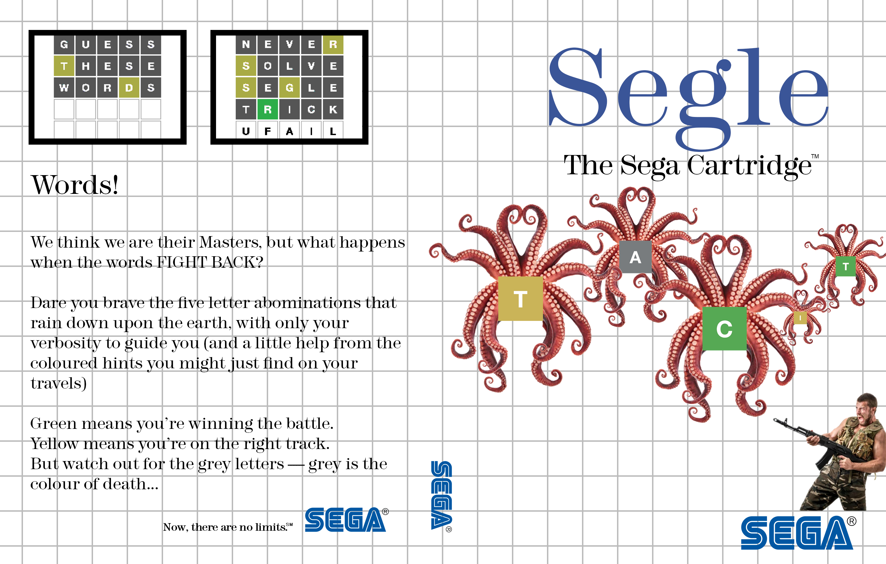

# Segle

[Wordle](https://www.nytimes.com/games/wordle/index.html) clone for Sega Master System (SMS).

## The game
### Aim

Guess the word in six guesses or fewer.

There are 2309 possible answers.

Each guess generates a colour-coded response:

- Grey = guessed letter is not in the answer
- Green = guessed letter is in the answer, in the place guessed
- Yellow = there is still at least one instance of the guessed letter to be found in the answer, but it's in a different position from the one guessed

The game ends when either the answer has been correctly guessed (all green tiles), or when all six guesses have been used up.
### Controls

- Up cycles through the letters of the alphabet, from A to Z
- Down cycles through the letters of the alphabet, from Z to A
- Left deletes a letter from the current guess. Action button 1 also does the same thing.
- Right accepts the currently selected letter and moves onto the next letter in the guess

- Action button 1 deletes a letter from the current guess. Left also does the same thing.
- Action button 2 submits the guess and moves onto the next guess unless the game is over

The reset button starts a new game after the current game has ended.
The pause button does nothing.

### Limitations

The real Wordle game checks all guesses are actually dictionary words. This makes the game harder.

I haven't yet implemented this in Segle, but it is planned.

## Building

This was written to target the `z88dk-z80asm` assembler, which is easy enough to use but quite limited in terms of directives, etc.

I might transfer over to a different assembler at some point.

### Build steps

1. Install `z88dk` from https://z88dk.org/site/download
2. Ensure `make` is available
3. Change directory to this repo
4. Run `make`

The build binary is `build/segle.sms` and should be capable of being loaded into any SMS emulator or being burned to a ROM and run on some real hardware...

### Tile art

I wrote a basic utility in Python for generating SMS tile art from a bitmap file which is how I generated the tile art in this project.

This can be found in https://github.com/retcon85/retcon-util as `img2tiles.py`

If you have this utility in a folder called `../retcon-utils` relative to the `segle` project, you can run `make tiles` to generate new tile data from an updated `letters4x4.bmp`

### Recommended development resources

- [SMSPower!](https://www.smspower.org/) - incredible site which can answer most any question you might have about developing for the SMS
- [Emulicious](https://emulicious.net/) - good accurate emulator with built in debugger and tile viewer
- [Z88DK](https://z88dk.org/site/) - toolchain including C compiler and linker targeting SMS amongst other platforms
- [Aseprite](https://www.aseprite.org/) - nice little sprite / pixel art tool
- [Adobe Photoshop](https://www.adobe.com/uk/products/photoshop.html) - for all the heavy lifting before getting things into Aseprite

## Cartridge case cover

